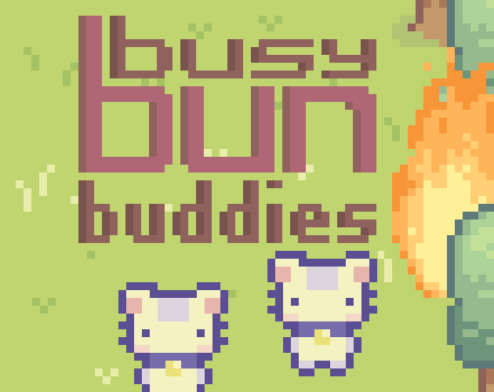
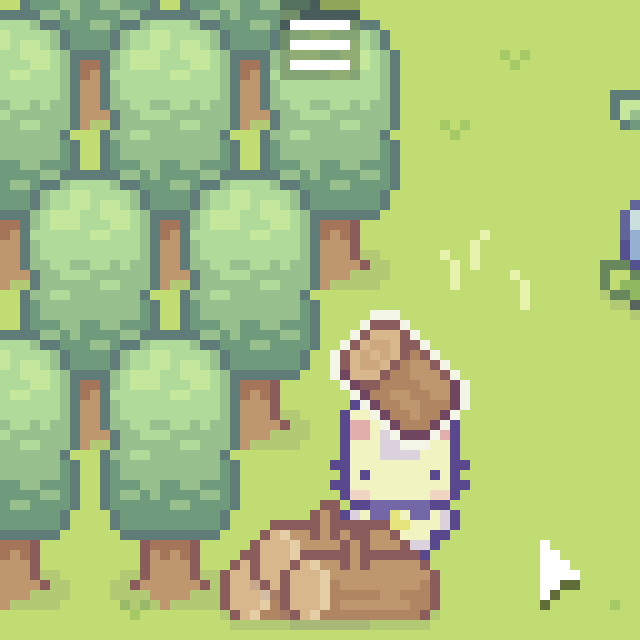
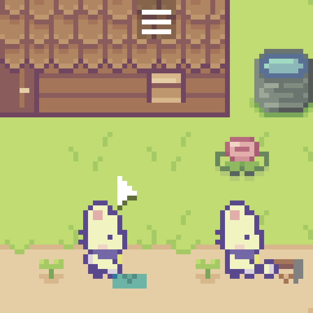
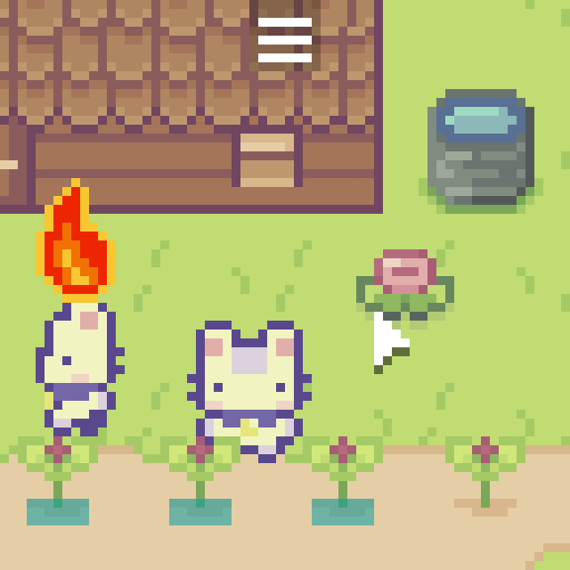
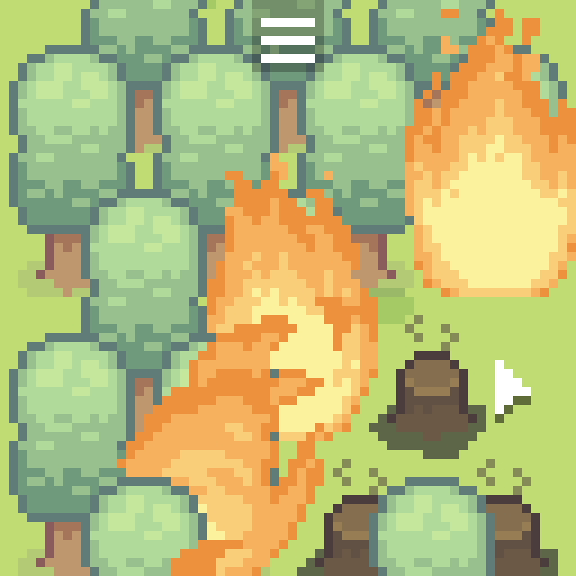
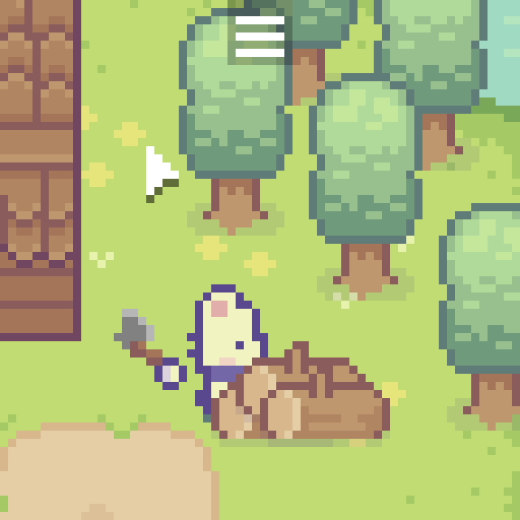
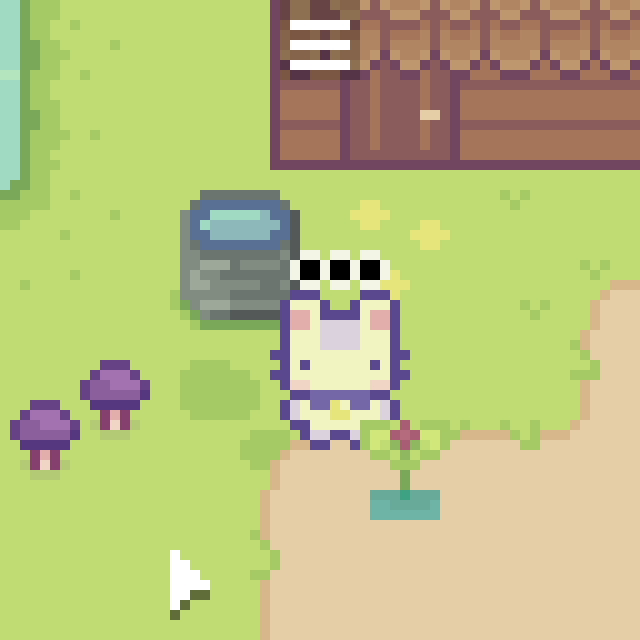

# Busy Bun Buddies

The game was originally made for [LOWREZJAM 2023](https://itch.io/jam/lowrezjam-2023)
which restricts the resolution to 64x64 pixels and ran for 2 weeks
between 1st and 14th August 2023. The jam had ten optional themes, I
picked a few of them (higlighted in italic in the intro text below)
and tried to include in the game.

## Intro

Busy little buns are doing their jobs to prepare for the winter, it's not
an easy job but they are good at *cooperating*. Sometimes they find
things on the ground, there might be matches *hidden in plain sight* and
Buns are curious creatures, they'll play with it. You have to
*catch 'em all* before they set the forest on fire accidentally and the
*wildfire* spreads to the whole island.

## The jam version

Play the jam version here: https://gheja.itch.io/busy-bun-buddies

## The latest version

I worked on the game a bit more after submitting it.

Check it out here: https://gheja.itch.io/busy-bun-buddies-latest

## Screenshots

## Credits

I decided to go with only publicly available royalty free assets.

For a detailed list of files and the licenses see: [licenses.md](licenses.md)

Gabor Heja - code, additional graphics, sounds

Cup Nooble - graphics ([Sprout Lands Basic pack](https://cupnooble.itch.io/sprout-lands-asset-pack))

bdragon1727 - graphics ([Free  Effect Bullet Impact Explosion 32x32 V1](https://bdragon1727.itch.io/free-effect-bullet-impact-explosion-32x32))

Swaylle / Skar0ps - music ([Café](https://opengameart.org/content/caf%C3%A9))

Ten by Twenty - font ([Munro](https://www.fontsquirrel.com/fonts/munro))
